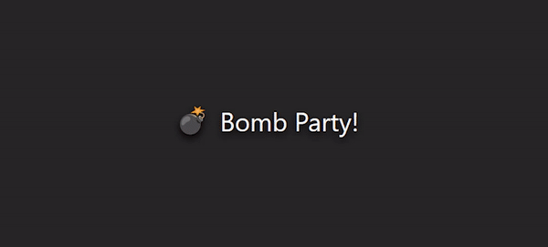

<h1 align="center">Yet Another Bomb Party Clone 💣</h1>
<p align="center">

</p>

## Description

This repository contains a clone of the popular game "BombParty", developed using Next.js and TypeScript. Bomb Party is a fast-paced word game where players take turns to type words as quickly as possible to avoid the "bomb" exploding.

## Features

- Real-time multiplayer gameplay
- Word typing challenge
- Explosive fun!

## Requirements

If you want to try app by yourself, you will need:

- Node.js v10.13 or higher

## Setup

Follow these steps to set up and run the Bomb Party clone on your local machine:

1. Clone the repository and install all required dependencies:

```shell
git clone https://github.com/richardscull/YetAnotherBombPartyClone
cd Richards-Blog
npm install
```

2. Create `.env.local` and setup it like this:

```env
NEXTAUTH_SECRET= # Generate a secret with `openssl rand -base64 32`
NEXTAUTH_URL= # The URL of your app, enter "localhost:3000" if you are not planning to host to the web.
NEXT_PUBLIC_URL= # The URL of your app, enter "localhost:3000" if you are not planning to host to the web.
DISCORD_CLIENT_ID= # Your Discord client ID
DISCORD_CLIENT_SECRET= # Your Discord client secret
PUBLIC_LOBBY_DICTIONARY= # Choose a dictionary for the public lobby. Refer to `dictionaryType` from types.d.ts to see the available options. Defaults to `english`
```

3. Build and start the server

```shell
npm run build
npm run start
```

###### ⚠️ Don't forget to add the Redirect to `http://your-url-site/api/auth/callback/discord` [here](https://discord.com/developers/applications).

4. Open your web browser and visit `http://your-url-site` to play the game.

## Technologies

- Next.js
- TypeScript
- Socket.io for real-time communication
- Tailwind CSS
